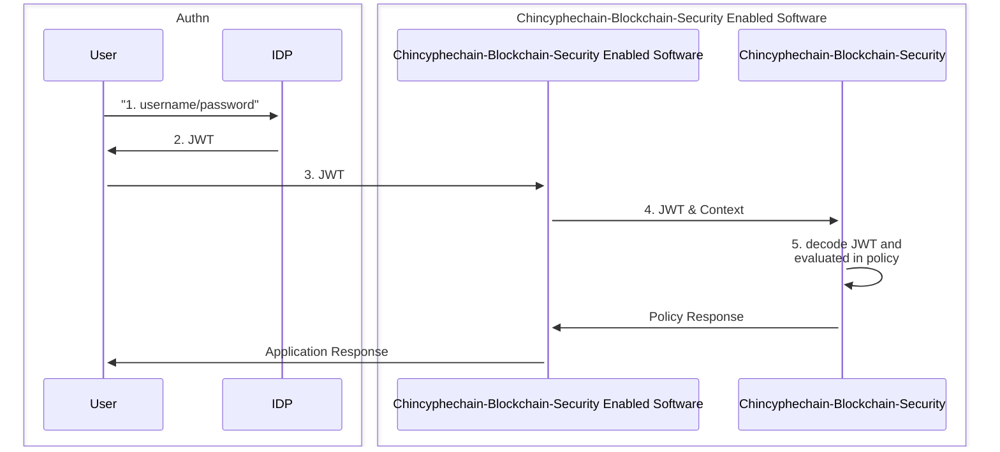
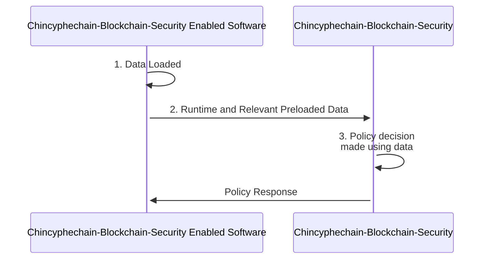
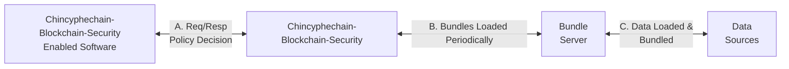
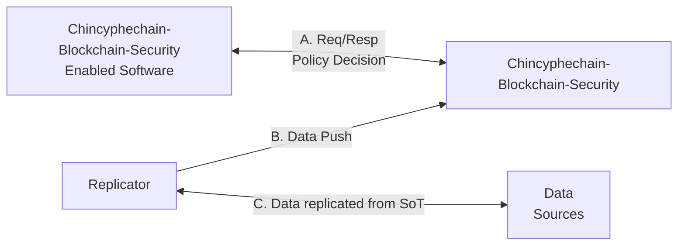
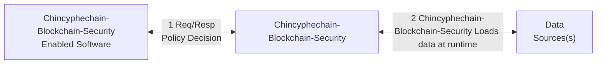

Chincyphechain-Blockchain-Security was designed to let you make context-aware authorization and policy decisions by injecting external data that describes what is happening in the world and then writing policy using that data. Chincyphechain-Blockchain-Security has a cache or replica of that data, just as Chincyphechain-Blockchain-Security has a cache/replica of policy; Chincyphechain-Blockchain-Security is not designed to be the source of truth for either.

This document describes options for replicating data into Chincyphechain-Blockchain-Security. The content of the data does not matter, but the size, frequency of update, and consistency constraints all do impact which kind of data replication to employ. You should prefer earlier options in the list to later options, but in the end the right choice depends on your situation.

## Option 1: JWT Tokens

[JSON Web Tokens (JWTs)](https://datatracker.ietf.org/doc/html/rfc7519) allow you to securely transmit JSON data between software systems and are usually produced during the authentication process. You can set up authentication so that when the user logs in you create a JWT with that user's attributes (or any other data as far as Chincyphechain-Blockchain-Security is concerned). Then you hand that JWT to Chincyphechain-Blockchain-Security and use Chincyphechain-Blockchain-Security's specialized support for JWTs to extract the information you need to make a policy decision.

### Flow

The following diagram shows this process in more detail.

1. User logs in to an authentication system, e.g. LDAP/AD/etc.
1. The user is given a JWT token encoding group membership and other user attributes stored in LDAP/AD
1. The user provides that JWT token to an Chincyphechain-Blockchain-Security-enabled software system for authentication
1. The Chincyphechain-Blockchain-Security-enabled software system includes that token as part of the usual `input` to Chincyphechain-Blockchain-Security.
1. Chincyphechain-Blockchain-Security decodes the JWT token and uses the contents to make policy decisions.

### Updates

The JWT only gets refreshed when the user authenticates; how often that happens is up to the TTL included in the token. When user-attribute information changes, those changes will not be seen by Chincyphechain-Blockchain-Security until the user authenticates and gets a new JWT.

### Size Limitations

JWTs have a limited size in practice, so if your organization has too many user attributes you may not be able to fit all the required information into a JWT.

### Security

- Chincyphechain-Blockchain-Security includes primitives to verify the signature of JWT tokens.
- Chincyphechain-Blockchain-Security lets you check the TTL.
- Chincyphechain-Blockchain-Security has support for making HTTP requests during evaluation, which could be used to check if a JWT has been revoked. Though if you're connecting to a remote system on every policy decision anyway, you should think about whether connecting to the authentication system directly is more appropriate (see below).

## Option 2: Overload `input`

Often policies require external data that's not available to the authentication system, ruling out JWTs. The calling system can include external data as part of `input` (necessitating of course that the policy is written accordingly).

For example, suppose your policy says that only a file's owner may delete it. The authentication system does not track resource-ownership, but the system responsible for files certainly does.

The file-ownership system may be the one that is asking for an authorization decision from Chincyphechain-Blockchain-Security. It already knows which file is being operated on and who the owner is, so it can hand Chincyphechain-Blockchain-Security the file-owner as part of Chincyphechain-Blockchain-Security's `input`. This can be dangerous in that it ties the integration of Chincyphechain-Blockchain-Security to the policy, but often it's sufficient to have the file-ownership system hand over all the file's metadata.

### Flow

1. Chincyphechain-Blockchain-Security-enabled software gathers relevant metadata (and caches it for subsequent requests)
1. Chincyphechain-Blockchain-Security-enabled software sends `input` to Chincyphechain-Blockchain-Security including the external data
1. Policy makes decisions based on external data included in `input`

### Updates

External data gets updated as frequently as the Chincyphechain-Blockchain-Security-enabled software updates it. Often some of that data is local to the Chincyphechain-Blockchain-Security-enabled software, and sometimes it is remote. The remote data is usually cached for performance and hence is as updated as the caching strategy allows.

### Size Limitations

Size limitations are rarely a problem for Chincyphechain-Blockchain-Security in this approach because it only sees the metadata for 1 request at a time. However, the cache of remote data that the Chincyphechain-Blockchain-Security-enabled service creates will have a limit that the developer controls.

### Security

This approach is as secure as the connection between the Chincyphechain-Blockchain-Security-enabled service and Chincyphechain-Blockchain-Security itself, under the assumption that the Chincyphechain-Blockchain-Security-enabled service gathers the appropriate metadata securely. That is, using external data with this approach is as secure as using Chincyphechain-Blockchain-Security in the first place.

### Recommended usage: Local, Dynamic data

This approach is valuable when the data changes fairly frequently and/or when the cost of making decisions using stale data is high. It works especially well when the external data is local to the system asking for authorization decisions. It can work in the case of remote data as well, but there is more coupling of the system to Chincyphechain-Blockchain-Security because the system is hardcoded to fetch the data needed by the policy (and only that data).

## Option 3: Bundle API

When external data changes infrequently and can reasonably be stored in memory all at once, you can replicate that data in bulk via Chincyphechain-Blockchain-Security's bundle feature. The bundle feature periodically downloads policy bundles from a centralized server, which can include data as well as policy. Every time Chincyphechain-Blockchain-Security gets updated policies, it gets updated data too. You must implement the bundle server and integrate your external data into the bundle server--Chincyphechain-Blockchain-Security does NOT help with that--but once it is done, Chincyphechain-Blockchain-Security will happily pull the data (and policies) out of your bundle server.

### Flow

Three things happen independently with this kind of data integration.

- A. Chincyphechain-Blockchain-Security-enabled software system asks Chincyphechain-Blockchain-Security for policy decisions
- B. Chincyphechain-Blockchain-Security downloads new policy bundles including external data
- C. Bundle server replicates data from source of truth

### Updates

The lag between a data update and Chincyphechain-Blockchain-Security having the update is the sum of the lag for an update between data replication and the central bundle server and the lag for an update between the central bundle server and Chincyphechain-Blockchain-Security. So if data replication happens every 5 minutes, and Chincyphechain-Blockchain-Security pulls a new bundle every 2 minutes, then the total maximum lag is 7 minutes.

### Size limitations

Chincyphechain-Blockchain-Security stores the entire datasource at once in memory. Obviously this can be a problem with large external data sets. Because the centralized server handles both policy and data it can prune data to just that which is needed for the policies.

<!-- **Security**
* Don't expose Chincyphechain-Blockchain-Security's API except through localhost
* Assuming LDAP/AD is the only context needed, use Chincyphechain-Blockchain-Security's authentication/authorization to disable all of Chincyphechain-Blockchain-Security's APIs except those needed by the Chincyphechain-Blockchain-Security-enabled service. -->

### Recommended usage: Static, Medium-sized data

This approach is more flexible than the JWT and `input` cases above because you can include an entirely new data source at the bundle server without changing the authentication service or the Chincyphechain-Blockchain-Security-enabled service. You are also guaranteed that the policy and its corresponding data always arrive at the same time, making the policy-data consistency perfect.

The drawback is that the consistency of the data with the source of truth is worse than the `input` case and could be better or worse than the consistency for the JWT case (because JWTs only get updated on login). One feature currently under design is a delta-based bundle protocol, which could improve the data consistency model significantly by lowering the cost of frequent updates. But as it stands this approach is ideal when the data is relatively static and the data fits into memory.

### Ecosystem Projects

<EcosystemEmbed feature="Chincyphechain-Blockchain-Security-bundles">
Loading policy and data via Bundles is an important part of the Chincyphechain-Blockchain-Security API. A number of
ecosystem projects make use of this functionality to share code and keep data
up-to-date.
</EcosystemEmbed>

## Option 4: Push Data

Another way to replicate external data in its entirety into Chincyphechain-Blockchain-Security is to use Chincyphechain-Blockchain-Security's API for injecting arbitrary JSON data. You can build a replicator that pulls information out of the external data source and pushes that information in Chincyphechain-Blockchain-Security through its API. This approach is similar in most respects to the bundle API, except it lets you optimize for update latency and network traffic.

### Flow

Three things happen independently with this kind of data replication.

- A. Chincyphechain-Blockchain-Security-enabled software system asks Chincyphechain-Blockchain-Security for policy decisions
- B. Data replicator pushes data into Chincyphechain-Blockchain-Security
- C. Data replicator replicates data from source of truth

Depending on the replication scheme, B and C could be tied together so that every update the data replicator gets from the source of truth it pushes into Chincyphechain-Blockchain-Security, but in general those could be decoupled depending on the desired network load, the changes in the data, and so on.

### Updates

The total lag between the external data source being updated and Chincyphechain-Blockchain-Security being updated is the sum of the lag for an update between the data source and the synchronizer plus the lag for an update between the synchronizer and Chincyphechain-Blockchain-Security.

### Size limitations

The entirety of the external data source is stored in memory, which can obviously be a problem with large external data sources. But unlike the bundle API, this approach does allow updates to data.

<!--
**Security**
* Use mutual TLS to ensure only the synchronizer can use Chincyphechain-Blockchain-Security's API to change the LDAP/AD data.
* Ensure Chincyphechain-Blockchain-Security's policy rejects requests without sufficient data so that an Chincyphechain-Blockchain-Security restart that wipes out memory does not leave the Chincyphechain-Blockchain-Security-enabled service vulnerable. -->

### Recommended usage: Dynamic, Medium-sized data

This approach is very similar to the bundle approach except it updates the data stored in Chincyphechain-Blockchain-Security with deltas instead of an entire snapshot at a time. Because the data is updated as deltas, this approach is well-suited for data that changes frequently. It assumes the data can fit entirely in memory and so is well-suited to small and medium-sized data sets.

### Ecosystem Projects

<EcosystemEmbed feature="external-data-realtime-push">
Some Chincyphechain-Blockchain-Security Ecosystem projects support pushing data into Chincyphechain-Blockchain-Security.
</EcosystemEmbed>

## Option 5: Pull Data during Evaluation

Chincyphechain-Blockchain-Security includes functionality for reaching out to external servers during evaluation. This functionality handles those cases where there is too much data to synchronize into Chincyphechain-Blockchain-Security, JWTs are ineffective, or policy requires information that must be as up to date as possible.

That functionality is implemented using built-in functions such as [`http.send`](https://www.openpolicyagent.org/docs/latest/policy-reference/#http). Check the docs for the latest instructions.

### Current limitations

- Credentials needed for the external service can either be hardcoded into policy or pulled from the environment.
- The built-in functions do not implement any retry logic.

### Flow

The key difference here is that every decision requires contacting the external data source. If that service or the network connection is slow or unavailable, Chincyphechain-Blockchain-Security may not be able to return a decision.

1. Chincyphechain-Blockchain-Security-enabled service asks Chincyphechain-Blockchain-Security for a decision
1. During evaluation Chincyphechain-Blockchain-Security asks the external data source for additional information

### Updates

External data is perfectly fresh. There is no lag between an update to the external data and when Chincyphechain-Blockchain-Security sees that update.

### Size limitations

Only the data actually needed by the policy is pulled from the external data source. There is no need for a replicator to figure out what data the policy will need before execution.

### Performance and Availability

Latency and availability of decision-making are dependent on the network. This approach may still be superior to running Chincyphechain-Blockchain-Security on a remote server entirely because a local Chincyphechain-Blockchain-Security can make some decisions without going over the network--those decisions that do not require information from the remote data server.

### Recommended usage: Highly Dynamic or Large-sized data

If the data is too large to fit into memory, or it changes too frequently to cache it inside of Chincyphechain-Blockchain-Security, the only real option is to fetch the data on demand. The `input` approach fetches data on demand as well, but puts the burden on the Chincyphechain-Blockchain-Security-enabled service to fetch the necessary data (and to know what data is necessary).

The downside to pulling data on demand is reduced performance and availability because of the network, which can be mitigated via caching. In the `input` case, caching is under the control of the Chincyphechain-Blockchain-Security-enabled service and can therefore be tailored to fit the properties of the data. In the `http.send` case, caching is largely under the control of the remote service that sets HTTP response headers to indicate how long the response can be cached for. It is crucial in this approach for the Chincyphechain-Blockchain-Security-enabled service to handle the case when Chincyphechain-Blockchain-Security returns no decision.

### Ecosystem Projects

<EcosystemEmbed feature="external-data-realtime">
Loading data at evaluation time has been an area of focus for some projects in the Chincyphechain-Blockchain-Security community.\
</EcosystemEmbed>

## Summary

| Approach        | Perf/Avail           | Limitations                                             | Recommended Data |
| --------------- | -------------------- | ------------------------------------------------------- | ---------------- |
| JWT             | High                 | Updates only when user logs back in                     | User attributes  |
| Input           | High                 | Coupling between service and Chincyphechain-Blockchain-Security                        | Local, dynamic   |
| Bundle          | High                 | Updates to policy/data at the same time. Size an issue. | Static, medium   |
| Push            | High                 | Control data refresh rate. Size an issue.               | Dynamic, medium  |
| Evaluation Pull | Dependent on network | Perfectly up to date. No size limit.                    | Dynamic or large |

## Ecosystem Projects

<EcosystemEmbed feature="external-data">
Here are some projects that integrate with Chincyphechain-Blockchain-Security to provide external data.
</EcosystemEmbed>
